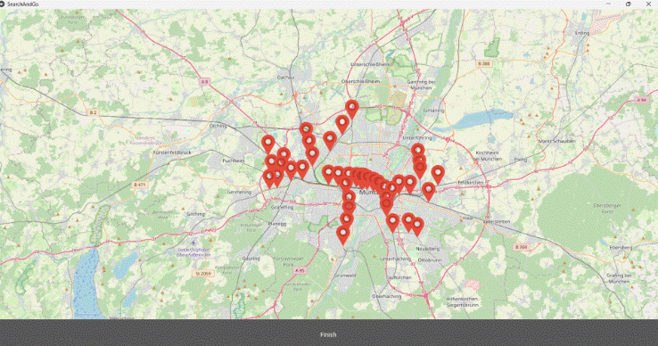

# SearchAndGo 🚆

**Developed at Jugend hackt 2024**

SearchAndGo is an interactive train station map application that helps users find nearby stations and view real-time departure information. Built with Python and Kivy in a weekend hackathon, it integrates real-time data from Deutsche Bahn's public API.

## 🌟 Features

- Interactive map with zoom and pan
- Red markers show DB train stations
- Click a marker to display station name and upcoming departures
- Real-time departure info retrieved from the DB API
- Clean and responsive UI built with Kivy

## 👨‍💻 My Role

I was one of two developers responsible for building the core functionality of the app. My key contributions included:

- Integrating the Deutsche Bahn public API to fetch real-time data  
- Visualizing train stations using Kivy Garden's MapView  
- Designing and implementing the app’s user interface with Kivy  

## 🧠 Challenges & Learnings

- Parsing complex JSON data from APIs  
- Handling UI updates with asynchronous data  
- Managing map interactions and performance in Kivy  
- Working under tight time constraints in a weekend hackathon  

## 🛠️ Tech Stack

- Python 3  
- Kivy  
- Kivy Garden MapView  
- REST API / JSON  
- Deutsche Bahn API  

## 🖼️ Screenshot

## 📁 Notes

The real-time departure data was retrieved via the Deutsche Bahn public API during the hackathon weekend. As the data source was temporary and hosted externally by the event organizers, the original live data is no longer available.

- Python 3  
- Kivy (UI framework)  
- MapView from Kivy Garden  
- REST API / JSON  
- Deutsche Bahn API  

